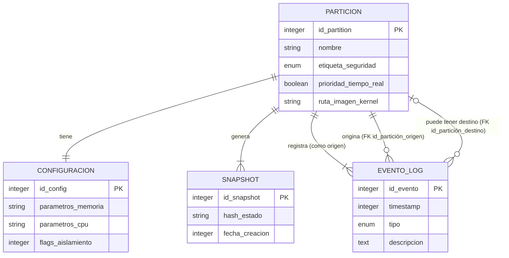

# Milvirt - Hypervisor Militar-Diagramas

## Arquitectura del sistema

## Diagrama de secuencia

```mermaid
flowchart TD
    A[Operador enciende hardware] --> B[Bootstrap carga microkernel]
    B --> C[Inicializar tablas de memoria]
    C --> D[Crea partición Radar (tiempo real)]
    C --> E[Crea partición Usuario]

    D --> F[Sistema Radar envía datos asíncronos]
    F --> G[Partición Radar recibe interrupción]
    G --> H[ACK al microkernel]

    E --> I[Operador abre sesión en consola]
    I --> J[Consola solicita UI a partición Usuario]
    J --> K[Envía interfaz de usuario]
    K --> L[Operador visualiza pantalla]

    subgraph Ataque [Escenario de ataque]
        M[Atacante inyecta código malicioso] --> N[Partición Usuario solicita escritura a Radar]
        N --> O[Microkernel verifica etiquetas de seguridad]
        O --> P{¿Permiso concedido?}
        P -- No --> Q[Notifica violación al Monitor de Integridad]
        Q --> R[Monitor registra evento en Log Inmutable]
        R --> S[Error: acceso denegado]
        S --> T[Consola muestra 'Acceso no autorizado']
        P -- Sí --> U[Operación normal]
    end

    L --> O

    style Ataque fill:#2d2d2d,stroke:#ff4444,stroke-width:2px
    style Q fill:#441111,stroke:#ff8888
    style R fill:#441111,stroke:#ff8888
    style S fill:#441111,stroke:#ff8888
```

## Diagrama de Casos de uso

```mermaid
graph TD
    actor(Administrador MLS) as AdminMLS
    actor(Oficial de seguridad) as Seguridad
    actor(Operador) as Operador
    actor(Sistema de radar) as Radar
    actor(Atacante) as Atacante

    usecase(Configurar partición) as UC1
    usecase(Configurar política de flujo\n(Guard)) as UC2
    usecase(Ejecutar partición crítica) as UC3
    usecase(Auditar logs inmutables) as UC4
    usecase(Operar dentro de su partición) as UC5
    usecase(Transferencia autorizada por Guard) as UC6
    usecase(Infiltrar datos entre particiones) as UC_M1
    usecase(Desactivar monitor de integridad) as UC_M2
    usecase(Detectar violación de aislamiento) as UC_D1
    usecase(Bloquear comunicación no autorizada) as UC_D2
    usecase(Registrar evento en log inmutable) as UC_D3
    usecase(Verificar integridad periódica) as UC_D4

    AdminMLS --> UC1
    Seguridad --> UC2
    Seguridad --> UC4
    Seguridad --> UC6
    Operador --> UC5
    Radar --> UC3
    Atacante --> UC_M1
    Atacante --> UC_M2

    UC_M1 --> UC_D1 : <<include>>
    UC_D1 --> UC_D2 : <<include>>
    UC_D2 --> UC_D3 : <<include>>
    UC_M2 -.-> UC_D4 : <<extend>>
```
## Diagrama de Entidad relación

